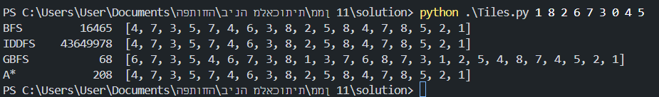
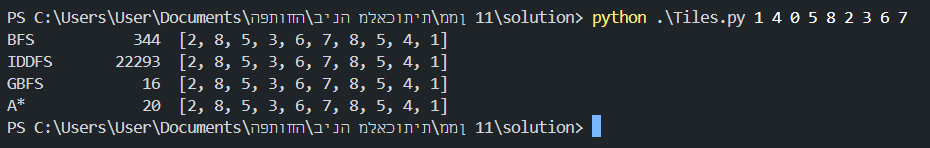
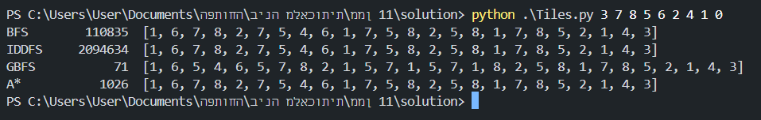
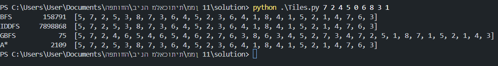

- **Name**: Max Shulov 

---

# 0. Introduction  

The 8-puzzle is a classic sliding tile problem where the objective is to arrange the numbered tiles in sequential order, starting from the top-left corner and proceeding row by row.

---

# 1. Program Outline  

### Key Components  

#### Classes  

- **Board()**:
    the "Main" entity of the program, holds the state of the board and solves it in various ways.
  - **Attributes**:  
    - `initial_state: List[int]`: the starting state of the board.  
  - **Methods**:  
    - `solve() -> None`: Runs through the program algorithms and solves the board in each way. 
    - `goal_reached(state) -> bool`: Checks whether or not a given `state` is a completed state.
    - `generate_children(node) -> Generator[Node, None, None]`: Produces successor nodes for a given node. 

- **Action()**:
    A class responsible for moving tiles around the board.
    - **Attributes**:
        - `node_state: Node`: current state of the board in the given time.
        - `empty_idx: int`: the index of the empty cell in the board.
    - **Methods**:
        - `up() -> Optional[List[int]]`: Moves the blank tile up if possible.  
        - `down() -> Optional[List[int]]`: Moves the blank tile down if possible.  
        - `left() -> Optional[List[int]]`: Moves the blank tile left if possible.  
        - `right() -> Optional[List[int]]`: Moves the blank tile right if possible. 

- **Algorithm(Enum)**:
    an enum class that holds the enums that should be run against the board.

- **Node()**:
    A point in time on the board.
    - **Attributes**:  
        - `state: List[int]`: the state of the board in the given time, will be used for history.
        - `parent: Optional[Node]`: previous node.
        - `depth: int`: how many moves were executed before this node.
    - **Methods**:  
        - `trace_path() -> List[int]`: Traces the path from the current node to the start. 

- **PrioritizedItem()**:
    Util class for using PriorityQueue.     
    - **Attributes**:  
        - `priority: int`: the priority.
        - `item: Any`: the data of the item, with a non compare field.
    
#### Algorithms  

- `a_star_search(board: Board) -> Tuple[Optional[Node], int, bool]`

- `bfs_search(board: Board) -> Tuple[Optional[Node], int, bool]`

- `gbfs_search(board: Board) -> Tuple[Optional[Node], int, bool]`

- `iddfs_search(board: Board) -> Tuple[Optional[Node], int, bool]`  

All of the algorithms return a tuple that contains the following:
##### 1. The final node.
##### 2. The number of of iterations it took the algorithm to solve.
##### 3. If the algorithm managed to solve it.
#### Helper Functions for the Puzzle  
- `best_first_search(board: Board, priority_func:  Callable[[Node], int]) -> Tuple[Optional[Node], int, bool]`: A class of search algorithms which explores a graph by expanding the most promising node chosen according to a specified rule.

- `def linear_conflicts(node: Node) -> int`: Calculates the linear conflicts distance on a board.

---

# 2. State Representation  

The puzzle's state is modeled as a list of 9 elements representing the tile arrangement. Possible actions for the blank tile (0) include up, down, left, and right, subject to these constraints:  

- Invalid moves occur when the blank tile is:  
  - In the top row (cannot move up).  
  - In the bottom row (cannot move down).  
  - In the left column (cannot move left).  
  - In the right column (cannot move right).  

---

# 3. Heuristic Function  

**_search_conflicts(state: List[int], mode = Literal['col', 'row']) -> int**:  
- This heuristic evaluates tile conflicts to improve search efficiency.  
- *Note*: The function takes a node as input but operates on its `layout` for convenience.  

---

# 4. Solution Quality  

- **Optimal Solutions**:  
  - Algorithms such as `BFS`, `IDDFS`, and `A*` guarantee optimal results by minimizing path costs.  
- **Suboptimal Solutions**:  
  - `GBFS` may fail to find the best solution, especially for complex paths, due to its local optimization approach.  

- **Proof**:
$$linearconflicts=LC$$
$$manhattandistance=MD$$
$$searchconflicts=SC$$
$LC= MD + 2*SC$ (1 for row and 1 for column).

we need to proof: $h(s)\le  c(s,a,s') + h(s')$

in out case we have: $c(s,a,s') = 1$
so we need to prove the following: $LC(s') + 1 \ge LC(s)$.

we have 3 different scenrios:
1. the tile wasn't moved to his row:
on this case we might went further from the wanted row or moved closer thus: $MD(s') = MD(s) \pm1$.
one way or another the conditions for $LC$ aren't met this $RC(s')=RC(s)$ and $CC(s')=CC(s)$.

thus:
$$LC(s') + 1 =\\ MD(s') + 2 SC + 1 =\\ MD(s)\pm1 + 2SC+1 =\\ LC(s) + 1 \pm 1 \ge LC(s)$$

2. The tile enters his row, thus: $MD(s')=MD(s)-1$.
because the tile moved to his row there could be conflicts thus: $RC(s')=RC(s)$ or $RC(s')=RC(s)+1$ and $CC(s')=CC(s)$.

$$LC(s')+1=\\ MD(s')+4*SC+1=\\ MD(s)-1+2*(SC + (0:or:1))+1=\\ LC(s)-1+1+2(0:or:1)\ge LC(s)$$

3. The tile moved out from his row thus: $MD(s')=MD(s)+1$
because the tile moved to his row there could be conflicts thus: $RC(s')=RC(s)$ or $RC(s')=RC(s)-1$ and $CC(s')=CC(s)$.

$$LC(s')+1=\\ MD(s')+2*SC+1=\\ MD(s)+1+2*(SC + (0:or:-1))+1=\\ LC(s)+2+2(0:or:-1)=\\ LC(s) + 2(0:or:1)\ge LC(s)$$

---

# 5. Input/Output  

